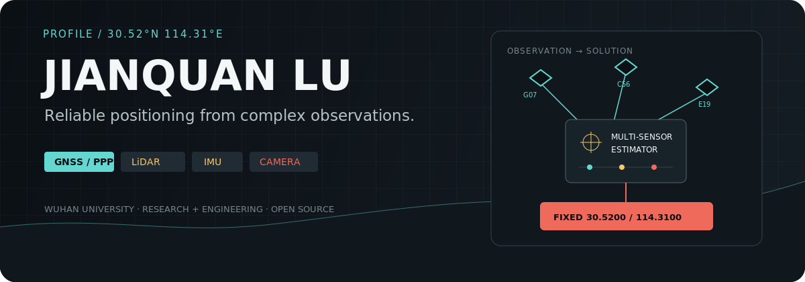
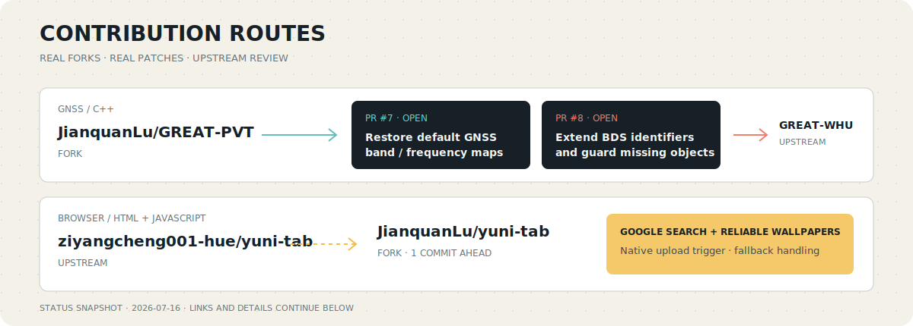

<p align="center">
  
</p>

<p align="center">
  <a href="mailto:xantheday663@gmail.com"></a>
  <a href="https://github.com/JianquanLu?tab=repositories"></a>
  
</p>

I am **Jianquan Lu**, a researcher and software engineer at **Wuhan University**. I work on precise positioning and navigation systems that combine GNSS, LiDAR, IMU, and camera observations, with a focus on robust state estimation and reproducible engineering.

## Open-source contributions

<p align="center">
  
</p>

### GREAT-PVT · upstream pull requests

I am contributing fixes back to [`GREAT-WHU/GREAT-PVT`](https://github.com/GREAT-WHU/GREAT-PVT), the precision positioning and navigation software maintained by the GREAT Group at Wuhan University.

- [`#7 Restore default GNSS band and frequency mappings`](https://github.com/GREAT-WHU/GREAT-PVT/pull/7) removes an unreachable-default failure, restores per-constellation defaults, and fixes QZSS switch fall-through. Verified with MSVC Release builds and one-epoch PPP runs.
- [`#8 Handle missing satellite objects and extend BDS satellite identifiers`](https://github.com/GREAT-WHU/GREAT-PVT/pull/8) adds current BDS PRNs through C63 and prevents missing satellite objects from causing a null-pointer crash. Verified against nine previously failing observation datasets.

Both pull requests are currently **open for upstream review**.

### YuNi Tab · useful changes on a fork

My [`JianquanLu/yuni-tab`](https://github.com/JianquanLu/yuni-tab) fork is currently **1 commit ahead** of [`ziyangcheng001-hue/yuni-tab`](https://github.com/ziyangcheng001-hue/yuni-tab). The fork:

- switches search and suggestions from Bing to Google;
- replaces the fragile wallpaper upload trigger with a native file-label interaction;
- adds explicit fallback and error handling when IndexedDB or wallpaper import fails.

## Research coordinates

```text
POSITIONING    GNSS / PPP / precise navigation
FUSION         LiDAR + IMU + camera observations
ESTIMATION     robust state estimation and calibration
ENGINEERING    C++ / Python / MATLAB / reproducible validation
```

## Public work

| Repository | Role | Current focus |
| --- | --- | --- |
| [`GREAT-PVT`](https://github.com/JianquanLu/GREAT-PVT) | Fork + upstream contributor | GNSS defaults, BDS coverage, runtime robustness |
| [`yuni-tab`](https://github.com/JianquanLu/yuni-tab) | Fork + independent improvements | Browser UX, Google suggestions, wallpaper reliability |
| [`JianquanLu`](https://github.com/JianquanLu/JianquanLu) | Profile source | This visual profile and contribution record |

## Working stack

<p>
  
  
  
  
  
  
</p>

<p align="center">
  <sub>Positioning research, careful validation, and practical open-source work.</sub>
</p>
